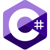
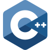
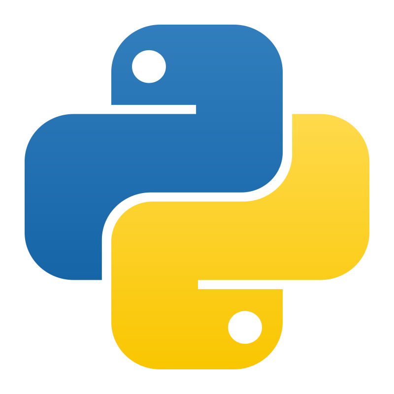

###### Last updated 9/16/2026

# Check out my [website!](https://poweringchurch.github.io/PoweringChurch/)

## Hello!

I'm Xavier, a high school student in Florida, and I mostly write in  C#,  C++, and  Python. 

I have a lot of ideas for different things that I want to see come to fruition in my life, and am working to achieve that every day by combining my passion for programming and engineering.

### Quick facts

* I'm currently holding a 4.5 weighted (4.0 unweighted) GPA
* I have competed nationally representing Florida in FBLA's 2025-2026 National Leadership Conference (NLC)
* I am enrolled in an A Rated technical school for engineering
* I am on track to earn the Florida Bright Futures' Academic Scholarship and College Board's AP Capstone Diploma
* I currently have 7 certifications
    * 5 in IT & Development
    * 2 in Business and Project Management